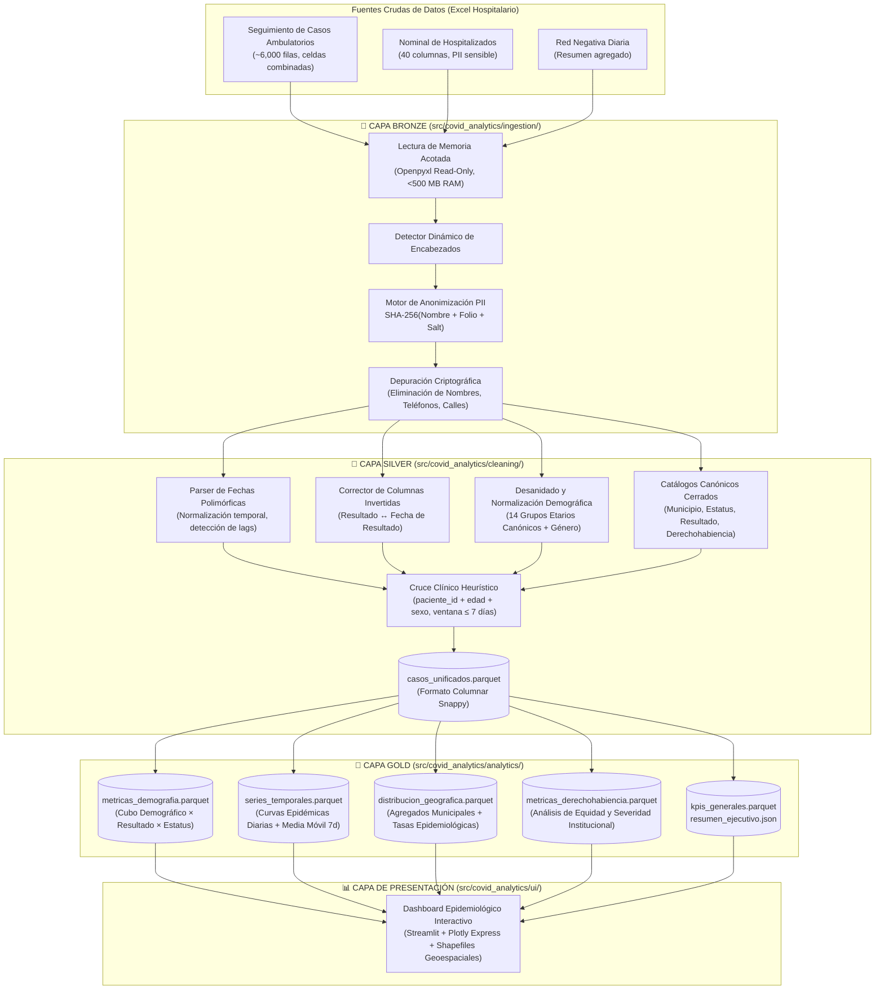

<div align="center">

# 🏥 COVID-19 Epidemiological Analytics & Medallion Data Platform
### *Hospital General Dr. Gustavo Baz Prada (Nezahualcóyotl, Estado de México)*

[](https://www.python.org/)
[](https://github.com/astral-sh/uv)
[-FFD700?style=for-the-badge)](https://databricks.com/glossary/medallion-architecture)
[](https://docs.pytest.org/)
[](https://mypy.readthedocs.io/)
[](https://github.com/astral-sh/ruff)
[](https://github.com/)

<p align="center">
  <b>Plataforma de Ingeniería de Datos y Vigilancia Epidemiológica de Grado Hospitalario</b><br>
  <i>Modernización integral de código legacy a una arquitectura desacoplada por capas (Bronze → Silver → Gold) con anonimización criptográfica PII-First, contratos de datos estrictos en Pydantic, algoritmos de cruce clínico heurístico y dashboard interactivo en Streamlit.</i>
</p>

---

</div>

## 📌 1. Resumen Ejecutivo & Contexto

Durante la emergencia sanitaria por SARS-CoV-2 en la Zona Metropolitana del Valle de México, el **Hospital General Dr. Gustavo Baz Prada** operó como un centro neurálgico de atención médica en el Estado de México.

Este proyecto transforma una base de datos hospitalaria cruda y fragmentada (~20,500 registros clínicos en libros de Excel con esquemas polimórficos, celdas combinadas y millones de filas fantasma) en una **plataforma analítica robusta, auditable y de alto rendimiento**.

### 🎯 Métricas Macro del Sistema (Dataset Consolidado)

```text
┌─────────────────────────────────┬──────────────────────────────────┬─────────────────────────────────┐
│     👥 20,148 Pacientes         │      🧪 5,013 Confirmados        │       📈 31.3% Positividad      │
│      Evaluados en Hospital      │         Casos SARS-CoV-2         │         Tasa Global Efectiva    │
├─────────────────────────────────┼──────────────────────────────────┼─────────────────────────────────┤
│     🏥 61.3% Hospitalización    │      🔗 12,166 Cruces            │       🛡️ 100% PII Anonimizado   │
│      Proporción en Positivos    │       Trayectorias Unificadas    │        Cero Fugas Criptográficas│
└─────────────────────────────────┴──────────────────────────────────┴─────────────────────────────────┘
```

> Métricas recalculadas a partir de `data/gold/resumen_ejecutivo.json` tras la corrida más
> reciente del pipeline completo (`--layer gold`).

---

## 🏗️ 2. Arquitectura de Datos: Medallion Pipeline

El sistema implementa una **Arquitectura Medallion** desacoplada gobernada por contratos de esquema inmutables y control de tipos estricto:



### Descripción de las Capas

1. **🥉 Capa Bronze (`src/covid_analytics/ingestion/`):**
   - **Lectura Acotada:** Consume libros de cálculo evitando materializar rangos fantasmas (>1,000,000 filas vacías) con un consumo de RAM inferior a 500 MB.
   - **PII-First:** Anonimización inmediata mediante hashing irreversible $\text{SHA-256}(\text{Nombre} + \text{Folio} + \text{Sal})$. Las columnas de nombres, teléfonos y direcciones se destruyen en memoria antes de persistir.
2. **🥈 Capa Silver (`src/covid_analytics/cleaning/`):**
   - **Normalización Semántica:** Resolución de captura errática (fechas seriales de Excel, texto libre con ruido, inversión de columnas resultado/fecha).
   - **Cruce Heurístico:** Reconstrucción del viaje del paciente unificando registros ambulatorios y hospitalarios sin folio compartido mediante ventana temporal $\Delta t \le 7$ días.
   - **Salida:** `data/silver/casos_unificados.parquet` (20,148 filas limpias y tipadas) + `data/silver/data_quality_summary.json` (telemetría del cruce y anomalías detectadas).
3. **🥇 Capa Gold (`src/covid_analytics/analytics/`):**
   - Agregaciones dimensionales en Apache Parquet particionadas para consumo analítico instantáneo (<5 ms por consulta).
4. **📊 Capa de Presentación (`src/covid_analytics/ui/`):**
   - Aplicación web reactiva en Streamlit desacoplada (carga inmutable desde Gold sin recalcular agregaciones en el frontend).

---

## 🛡️ 3. Gobernanza, Auditoría y Calidad de Datos

El desarrollo de este proyecto se rigió bajo la metodología **Spec-Kit** y la **Constitución del Proyecto** (`.specify/memory/constitution.md`), ejecutando un ciclo de auditoría técnica dual (Arquitectura & Contratos + Desarrollo TDD).

### Matriz de Hallazgos de Auditoría y Mitigaciones

| Vulnerabilidad Legacy / Calidad | Impacto en el Negocio | Mitigación Arquitectónica Implementada |
|---|---|---|
| **Acceso Posicional (`df.iloc`)** | Fragilidad extrema ante cualquier reordenamiento o inserción de columnas en Excel. | Ingesta guiada por **búsqueda de encabezados reales por coincidencia semántica**. |
| **Fuga Potencial de PII** | Exposición de nombres reales y domicilios de pacientes hospitalarios. | **Seudonimización Bronze obligatoria**. Cero columnas personales en Silver y Gold. |
| **Colapso por Memoria (OOM)** | Rangos de Excel inflados saturaban >50 GB de RAM. | Lectura acotada mediante **Openpyxl en modo Read-Only y corte anticipado**. |
| **Fechas Corruptas / Fuera de Época** | Registros con años `0202`, `2920` o `2038` generaban series de tiempo infladas (~1 millón de días). | **Ventana de validación epidemiológica** (`FECHA_MIN_VALIDA` = 2020-01-01 a `FECHA_MAX_VALIDA` = 2023-12-31, `cleaning/fechas.py`) con telemetría de anomalías (`fechas_anomalas_fuera_ventana`). |
| **Typo Sistemático de Año (2022)** | +300 registros con año `2022` en meses posteriores a enero — el dataset se gestionó solo hasta enero/2022, por lo que son typos del año real `2020` (mismo mes/día), no captura genuina. | Corrección dedicada `_corregir_anio_typo_dataset()`: reescribe el año a `2020` cuando `año == 2022 y mes > 1`, aplicada tras el parseo (cubre texto, `datetime` nativo y seriales de Excel). |
| **División por Cero en Tasas** | Valores `NaN` o `Inf` en cohortes con cero positivos. | Función matemática determinista `tasa_segura(num, den)` garantizando rango $[0.0, 1.0]$. |

---

## 📊 4. Insights Epidemiológicos Principales

```text
       DISTRIBUCIÓN POR SEXO                  TASA DE POSITIVIDAD POR GRUPO ETARIO
  ┌───────────────────────────────┐     ┌──────────────────────────────────────────┐
  │ 👩 Femenino:   55.3% (11,149) │     │  <18 años:   ████████ 21.9%              │
  │ 👨 Masculino:  44.2% (8,908)  │     │  18-39 años: ███████████ 28.8%           │
  │ ❓ Otro/Indet.: 0.5% (91)     │     │  40-59 años: █████████████ 34.4%         │
  └───────────────────────────────┘     │  60+ años:   ████████████████ 42.5%      │
                                        └──────────────────────────────────────────┘
```

1. **Vulnerabilidad por Edad:** La tasa de positividad aumenta de forma consistente con la edad, de **21.9%** en menores de 18 años hasta **42.5%** en adultos de 60+ años (`metricas_demografia.parquet`, agrupado por `grupo_edad_ui`).
2. **Severidad y Hospitalización:** El **61.3%** de los casos positivos confirmados registran estatus `HOSPITALIZADO`, reflejando el rol del hospital como centro de reconversión para casos moderados y severos.
3. **Cobertura del Catálogo Geográfico:** El catálogo cerrado de municipios (`cleaning/catalogos.py`) solo reconoce nombres de la ZMVM oriente; el **98.4%** de los registros no coincide con ninguna entrada y se agrega bajo el municipio sentinel `"OTROS"` (`distribucion_geografica.parquet`). Nezahualcóyotl (266 casos) y Ecatepec (16) son los únicos municipios catalogados con presencia notable — ampliar el catálogo es una mejora futura documentada, no una limitación silenciosa del pipeline.
4. **Derechohabiencia:** El **99.99%** de los registros no tiene derechohabiencia formal capturada en la fuente (`NINGUNA`, `metricas_derechohabiencia.parquet`), consistente con el perfil de un hospital general de la red pública sin aseguradora privada documentada.

---

## 💻 5. Stack Tecnológico & "El Guantelete" de Calidad

Este repositorio impone un estándar de calidad no negociable mediante cuatro compuertas de validación automatizadas (**"El Guantelete"**):

```text
                                   EL GUANTELETE DE CALIDAD
 ┌──────────────────────┬──────────────────────┬──────────────────────┬──────────────────────┐
 │    1. Tipado MyPy    │   2. Linter Ruff     │  3. Cobertura Pytest │ 4. Tests Sintéticos  │
 │    `--strict src`    │  `ruff check/format` │   `--cov-fail-under` │ Fixtures 100% Libres │
 │    0 errores / Any   │    0 infracciones    │      ≥ 90% (94%)     │   de PII Real        │
 └──────────────────────┴──────────────────────┴──────────────────────┴──────────────────────┘
```

- **Lenguaje & Entorno:** [Python 3.12](https://www.python.org/) administrado a ultra-alta velocidad con [Astral uv](https://github.com/astral-sh/uv).
- **Procesamiento & Formato Columnar:** [Pandas](https://pandas.pydata.org/), [PyArrow](https://arrow.apache.org/docs/python/) y compresión **Apache Parquet (Snappy)**.
- **Modelado & Contratos de Esquema:** [Pydantic v2](https://docs.pydantic.dev/) para garantizar tipado estricto en fronteras de capa.
- **Visualización & Dashboard:** [Streamlit](https://streamlit.io/) y [Plotly](https://plotly.com/python/) con mapas vectoriales GeoJSON/Shapefile.
- **Ingeniería de Pruebas:** [Pytest](https://docs.pytest.org/), `pytest-cov`, y `streamlit.testing.v1.AppTest` para pruebas headless de interfaz reactiva.

---

## 🚀 6. Guía Rápida de Instalación y Ejecución Local

### Prerrequisitos
- Tener instalado [uv](https://docs.astral.sh/uv/getting-started/installation/) (`curl -LsSf https://astral.sh/uv/install.sh` o `winget install --id=astral-sh.uv`).

### 1. Clonar el Repositorio e Instalar Dependencias
```bash
git clone https://github.com/MrJuancho/Covid19-Data-Analysis.git
cd Covid19-Data-Analysis

# Sincronizar entorno virtual reproducible con UV
uv sync
```

### 2. Ejecutar el Pipeline ETL Completo (Bronze → Silver → Gold)
```bash
# Pipeline de extremo a extremo: Bronze -> Silver -> Gold en una sola corrida
uv run python -m covid_analytics.pipeline \
  --excel-path "RED-NEGATIVA-COVID-02_VIGILANCIA-HOSPITALARIA 11.01.21.xlsx" \
  --output-dir data/silver \
  --layer gold \
  --gold-output-dir data/gold
```

Salida: `data/silver/casos_unificados.parquet` + `data/silver/data_quality_summary.json`
(Bronze → Silver) y `data/gold/*.parquet` + `data/gold/resumen_ejecutivo.json` (Silver → Gold).

> Si ya existe `data/silver/casos_unificados.parquet` y solo se necesita regenerar la capa
> Gold (ej. tras un cambio en `src/covid_analytics/analytics/`), se puede invocar el motor
> Gold de forma independiente, sin re-leer el Excel:
> ```bash
> uv run python -m covid_analytics.analytics.engine \
>   --silver-path data/silver/casos_unificados.parquet \
>   --output-dir data/gold
> ```

### 3. Ejecutar "El Guantelete" de Pruebas y Tipado Estricto
```bash
# Tipado estricto
uv run mypy --strict src

# Linter y formato
uv run ruff check src tests
uv run ruff format --check src tests

# Suite completa de pruebas con validación de cobertura
uv run pytest --cov=src --cov-fail-under=90
```

### 4. Lanzar el Dashboard Interactivo de Vigilancia Epidemiológica
```bash
uv run streamlit run src/covid_analytics/ui/app.py
```
> El dashboard se abrirá automáticamente en tu navegador web en `http://localhost:8501`.

---

## 📁 Estructura del Repositorio

```text
Covid19-Data-Analysis/
├── .specify/                         # Gobernanza Spec-Kit, plantillas y constitución
├── data/
│   ├── silver/                       # casos_unificados.parquet + data_quality_summary.json
│   └── gold/                         # Cubos analíticos Parquet y resumen_ejecutivo.json
├── docs/                             # Reporte de auditoría técnica y forense del legacy
├── mapa_mexico/                      # Shapefiles oficiales de división municipal (INEGI)
├── specs/                            # Especificaciones formales por feature (SDD)
│   ├── 001-covid-etl/                # Spec, Plan, Contratos y Tareas de Ingesta & Limpieza
│   ├── 002-covid-gold/               # Spec, Plan, Contratos y Tareas de Analítica Gold
│   └── 003-dashboard-epidemiologico/ # Spec, Plan, Contratos y Tareas del Dashboard Streamlit
├── src/
│   └── covid_analytics/
│       ├── ingestion/                # Capa Bronze: Lectura segura y hashing PII
│       ├── cleaning/                 # Capa Silver: Normalización y cruce heurístico
│       ├── analytics/                # Capa Gold: Motores de agregación y series temporales
│       ├── ui/                       # Capa de Presentación: Streamlit App y filtros
│       ├── models.py                 # Contratos de datos Pydantic
│       └── pipeline.py               # Orquestador CLI End-to-End
├── tests/
│   ├── fixtures/                     # Generadores sintéticos libres de PII
│   ├── unit/                         # Pruebas unitarias de cada módulo
│   └── integration/                  # Pruebas de integración y pipeline E2E
├── pyproject.toml                    # Configuración centralizada de herramientas y dependencias
└── README.md                         # Documentación ejecutiva del proyecto
```

---

<div align="center">

**Desarrollado con altos estándares de Ingeniería de Datos y Rigor Epidemiológico.**  
*Gobernado bajo la metodología Spec-Kit (Dual Agent SDD: Gemini Architect & Claude Code Developer).*

</div>