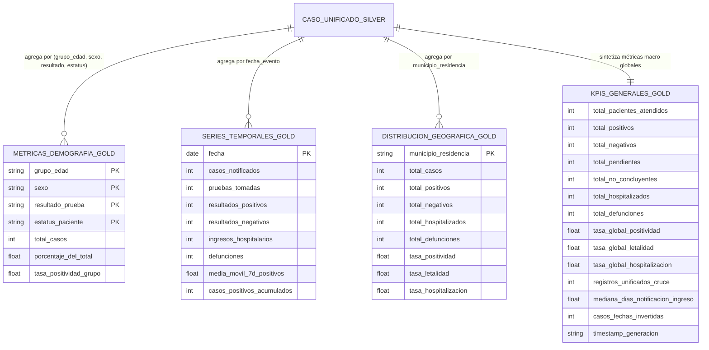

# Data Model: Capa Gold de Analítica y Agregaciones Epidemiológicas

**Feature**: `002-covid-gold` | **Spec**: [specs/002-covid-gold/spec.md](./spec.md)

Este documento define las entidades analíticas, esquemas tabulares y modelos de datos de la capa Gold (`src/covid_analytics/analytics/`), consumiendo `data/silver/casos_unificados.parquet`.

---

## 1. Diagrama de Relación de Entidades Gold

---

## 2. Definición de Catálogos y Bins Etarios

### Rangos Etarios Canónicos (`grupo_edad`)

| Código Rango | Límites de Edad (años) | Manejo en Datos |
|---|---|---|
| `0-1` | $[0.0, 1.0]$ | Incluye recién nacidos y lactantes |
| `2-11` | $[2.0, 11.0]$ | Infancia y edad escolar |
| `12-17` | $[12.0, 17.0]$ | Adolescentes |
| `18-24` | $[18.0, 24.0]$ | Adultos jóvenes |
| `25-30` | $[25.0, 30.0]$ | Adultos jóvenes (legacy bin) |
| `31-35` | $[31.0, 35.0]$ | Adultos |
| `36-40` | $[36.0, 40.0]$ | Adultos |
| `41-45` | $[41.0, 45.0]$ | Adultos maduros |
| `46-50` | $[46.0, 50.0]$ | Adultos maduros |
| `51-55` | $[51.0, 55.0]$ | Adultos mayores tempranos |
| `56-60` | $[56.0, 60.0]$ | Adultos mayores |
| `61-65` | $[61.0, 65.0]$ | Tercera edad |
| `66+` | $\ge 66.0$ | Tercera edad avanzada |
| `SIN_DATO` | `< 0.0` o `NaN` | Sentinel `-1.0` de la capa Silver |

---

## 3. Fórmulas de Cálculo Epidemiológico

1. **Tasa de Positividad:**
   $$\text{tasa\_positividad} = \begin{cases} \frac{\text{positivos}}{\text{positivos} + \text{negativos}} & \text{si } (\text{positivos} + \text{negativos}) > 0 \\ 0.0 & \text{en otro caso} \end{cases}$$

2. **Tasa de Letalidad (Case Fatality Rate - CFR):**
   $$\text{tasa\_letalidad} = \begin{cases} \frac{\text{defunciones\_positivas}}{\text{total\_positivos}} & \text{si } \text{total\_positivos} > 0 \\ 0.0 & \text{en otro caso} \end{cases}$$

3. **Tasa de Hospitalización:**
   $$\text{tasa\_hospitalizacion} = \begin{cases} \frac{\text{hospitalizados\_positivos}}{\text{total\_positivos}} & \text{si } \text{total\_positivos} > 0 \\ 0.0 & \text{en otro caso} \end{cases}$$

4. **Media Móvil de 7 Días (Retrospectiva):**
   $$\text{media\_movil\_7d}(t) = \frac{1}{7} \sum_{i=0}^{6} \text{casos}(t-i)$$
