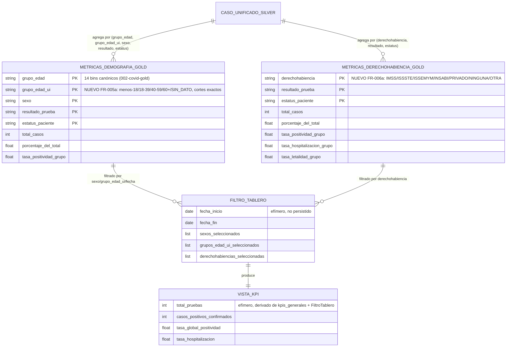

# Data Model: Dashboard Epidemiológico Interactivo (Streamlit)

**Feature**: `003-dashboard-epidemiologico` | **Spec**: [specs/003-dashboard-epidemiologico/spec.md](./spec.md)

Este documento define (1) las extensiones a entidades Gold ya existentes en 002-covid-gold,
(2) la nueva entidad Gold `MetricasDerechohabienciaGold`, y (3) las entidades efímeras de la
capa de presentación (`src/covid_analytics/ui/`), que nunca se persisten a disco.

---

## 1. Diagrama de Relación de Entidades

*(`SeriesTemporalesGold`, `DistribucionGeograficaGold` y `KpisGeneralesGold` no cambian de
esquema en esta feature; ver `specs/002-covid-gold/data-model.md` para su definición completa.)*

---

## 2. `MetricasDemografiaGold` — extensión FR-005a

| Columna | Tipo | Estado | Contrato |
|---|---|---|---|
| `grupo_edad` | `string` | Sin cambios (002) | Uno de los 14 bins canónicos, incluyendo `SIN_DATO` |
| `grupo_edad_ui` | `string` | **NUEVO** | Uno de `<18`, `18-39`, `40-59`, `60+`, `SIN_DATO`; calculado directamente desde `edad` con cortes exactos `[0, 18)`, `[18, 40)`, `[40, 60)`, `[60, ∞)` — **no** derivado de `grupo_edad` |
| `sexo`, `resultado_prueba`, `estatus_paciente` | `string` | Sin cambios (002) | Ver `specs/002-covid-gold/data-model.md` |
| `total_casos`, `porcentaje_del_total`, `tasa_positividad_grupo` | — | Sin cambios de fórmula (002) | `tasa_positividad_grupo` se recalcula por `(grupo_edad, sexo)` **y** por separado es consistente al granular también por `grupo_edad_ui`, ya que ambas columnas provienen de la misma fila Silver |

**Regla de integridad añadida**: para cualquier fila, `grupo_edad = "SIN_DATO"` ⟺ `grupo_edad_ui =
"SIN_DATO"` (ambas usan el mismo sentinel de `edad < 0` o nula). Ninguna otra combinación de
`grupo_edad`/`grupo_edad_ui` es válida salvo las que corresponden a la intersección real de sus
rangos numéricos (ej. `grupo_edad="36-40"` solo coexiste con `grupo_edad_ui ∈ {"18-39", "40-59"}`,
nunca con `"<18"` o `"60+"`).

---

## 3. `MetricasDerechohabienciaGold` — nueva entidad FR-006a

| Columna | Tipo lógico | Nulable | Contrato |
|---|---|---|---|
| `derechohabiencia` | `string` | No | Uno de `IMSS`, `ISSSTE`, `ISSEMYM`, `INSABI`, `PRIVADO`, `NINGUNA`, `OTRA` (catálogo estandarizado desde el texto libre de Silver; `OTRA` agrupa valores no reconocidos, ej. `SEDENA`) |
| `resultado_prueba` | `string` | No | Igual catálogo que `casos_unificados_silver` (001-covid-etl) |
| `estatus_paciente` | `string` | No | Igual catálogo que `casos_unificados_silver` |
| `total_casos` | `int64` | No | `>= 0` |
| `porcentaje_del_total` | `float64` | No | `0.0 <= x <= 1.0`, sobre el total global de `casos_unificados.parquet` |
| `tasa_positividad_grupo` | `float64` | No | `positivos / (positivos + negativos)` dentro del grupo `derechohabiencia`; `0.0` si denominador es 0 |
| `tasa_hospitalizacion_grupo` | `float64` | No | `hospitalizados_positivos / total_positivos` dentro del grupo; `0.0` si denominador es 0 |
| `tasa_letalidad_grupo` | `float64` | No | `defunciones_positivas / total_positivos` dentro del grupo; `0.0` si denominador es 0 |

**Regla de integridad**: la suma de `total_casos` sobre todas las filas DEBE ser idéntica al
número de filas de `data/silver/casos_unificados.parquet` (misma garantía FR-007 de
002-covid-gold), verificada por `verificar_consistencia_marginal` extendida.

---

## 4. Entidades efímeras de la capa de presentación (no persistidas)

### `FiltroTablero`

Estado de sesión (`st.session_state` o valores de retorno de los widgets del sidebar en cada
rerun de Streamlit — no hay persistencia entre sesiones, ver Assumptions de spec.md).

| Campo | Tipo | Contrato |
|---|---|---|
| `fecha_inicio`, `fecha_fin` | `date` | Acotados a `[min(fecha), max(fecha)]` de `series_temporales.parquet`, dentro de `[2020-01-01, 2023-12-31]` |
| `sexos` | `list[Literal["M", "F"]]` | Vacío ⟹ sin filtro (todas las categorías, incluyendo `OTRO`/`INDETERMINADO`); no vacío ⟹ coincidencia exacta |
| `grupos_edad_ui` | `list[Literal["<18","18-39","40-59","60+"]]` | Vacío ⟹ sin filtro |
| `derechohabiencias` | `list[Literal["IMSS","ISSSTE","ISSEMYM","INSABI","PRIVADO","NINGUNA"]]` | Vacío ⟹ sin filtro; `OTRA` no es seleccionable pero se incluye cuando no hay filtro |

### `VistaKPI`

Resultado puro (no widget) de aplicar `FiltroTablero` sobre `kpis_generales.parquet`/
`series_temporales.parquet`. Ver `contracts/ui_filtros_interface.md` para las firmas de función
exactas.

| Campo | Tipo | Fuente |
|---|---|---|
| `total_pruebas` | `int` | Suma de casos con `resultado_prueba` definido (incluye `PENDIENTE`/`NO_CONCLUYENTE`) tras aplicar `FiltroTablero` |
| `casos_positivos_confirmados` | `int` | Casos con `resultado_prueba = "POSITIVO"` tras filtro |
| `tasa_global_positividad` | `float` | `tasa_segura(positivos, positivos + negativos)` sobre el subconjunto filtrado |
| `tasa_hospitalizacion` | `float` | `tasa_segura(hospitalizados_positivos, positivos)` sobre el subconjunto filtrado |

### `ReporteCalidad`

Deserialización directa de `data/silver/data_quality_summary.json` (entidad `ResumenCalidad`,
001-covid-etl) — sin transformación, solo presentación tabular/tarjetas en la Pestaña 5.
